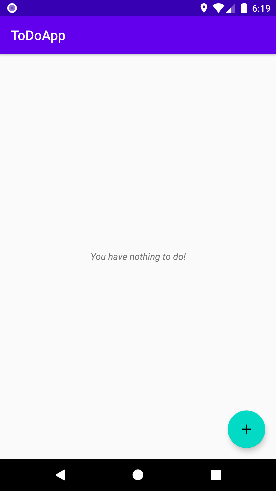
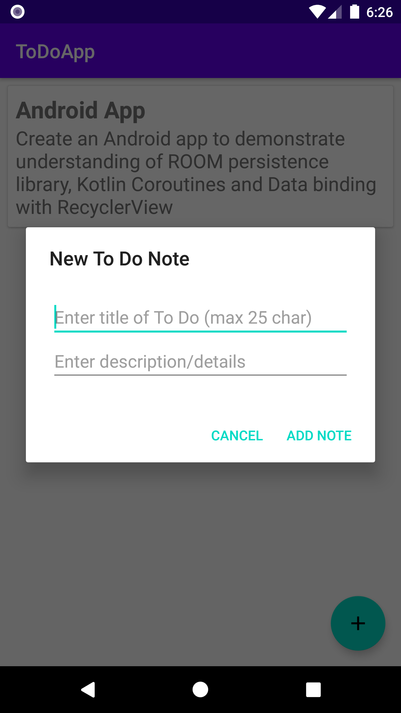
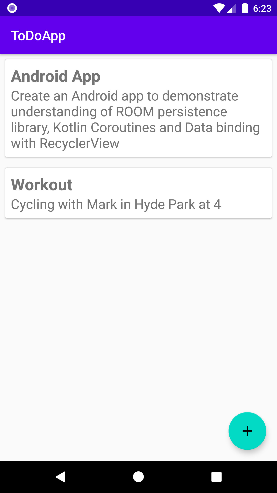

# ToDoApp

Simple android application that allows user to add "to do" items to track things "to do".User can also delete (by swiping task) items when complete or redundant. 

## Tech-stack used:

  - Kotlin
  - Room Persistence Library (Jetpack library)
  - MVVM
  - Kotlin Coroutines
  - Databinding with RecyclerView
  - ItemTouchHelper (for swipe feature)
  - DAO(Database Access Object)
  - Cardview

## Tech description:

  - ROOM Library: The Jetpack library provides an abstraction layer over SQLite to allow for a more robust database access with full power of SQLite, and without boilerplate code!
  - Kotlin Coroutines: Offers a way to handle long-running tasks elegantly and efficiently. It allows one to convert callback based code to sequential code. Its is asynchronous and non-blocking. No more boilerplate code that came with AsyncTask classes!

## Screeshots: 

      
